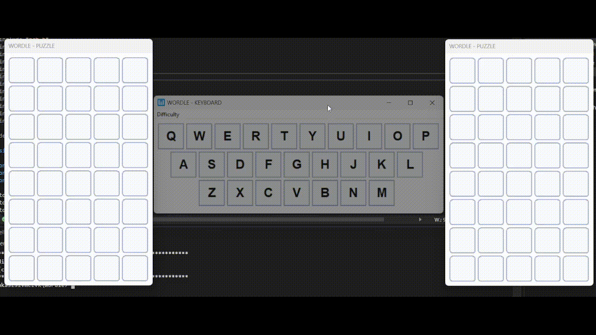

# Wordle

**Wordle** is a desktop implementation of the popular word-guessing game, built using **WinAPI**. The program introduces a unique twist with **three levels of difficulty** and an **on-screen keyboard** that enhances the gameplay experience.

---

## Game Modes
- **Level 1**: Single game window, 6 attempts.
- **Level 2**: Two game windows, 8 attempts.
- **Level 3**: Four game windows, 10 attempts.

The difficulty level is saved when you exit the game and will be automatically selected the next time you launch the program.

---

## Tech Stack
- **Framework**: WinAPI (C)
- **Interface**: Custom GUI with responsive on-screen keyboard.

---

## Presentation

